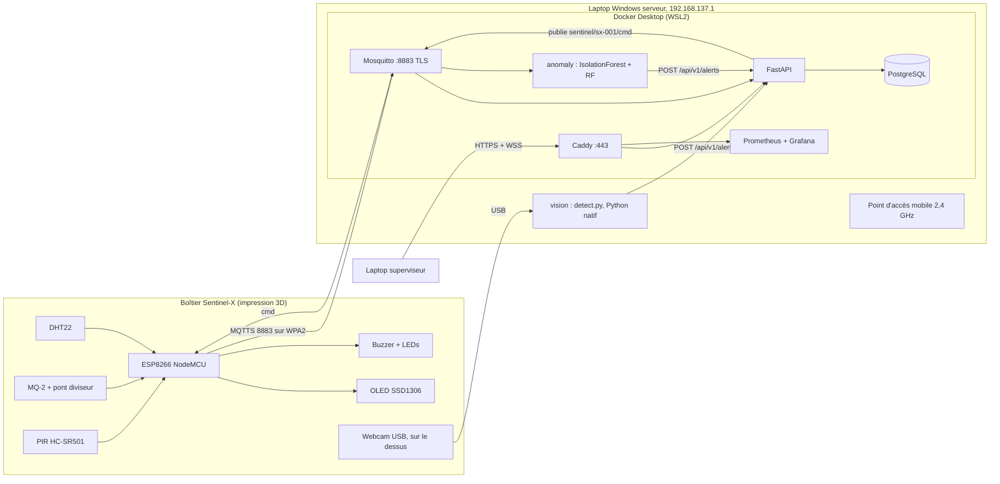

# 🏗️ Architecture globale (option B : laptop Windows serveur)

> [!summary] En une phrase
> L'ESP8266 publie les mesures en **MQTTS** vers Mosquitto sur le **laptop Windows serveur**, qui diffuse aussi le **Wi-Fi de démo** (point d'accès mobile, 192.168.137.1). L'API FastAPI stocke dans PostgreSQL et pousse en **WebSocket** vers le dashboard. Les services IA (vision et anomalies) lisent la webcam et la télémétrie, puis remontent leurs alertes via **`POST /api/v1/alerts`**. Les boutons du dashboard repartent en MQTT vers le buzzer et les LEDs.
> Mise en place : [[Serveur Windows (option B)]]. Décision : [[ADR-005 Option B laptop serveur]].

## Schéma


## Version texte (pour le PDF ou un tableau blanc)
```
 ┌──────────── BOÎTIER SENTINEL-X ────────────┐
 │ DHT22 MQ-2 PIR ─► ESP8266 ─► OLED/Buzzer/LEDs│
 │ Webcam USB (dessus)                         │
 └──────┬──────────────────────┬───────────────┘
        │ Wi-Fi WPA2 2,4 GHz    │ câble USB
        │ MQTTS:8883            │
        ▼                       ▼
 ┌────── LAPTOP WINDOWS SERVEUR 192.168.137.1 ──────┐
 │ Point d'accès mobile        vision (Python natif) │
 │ Docker: mosquitto ─► api(FastAPI) ─► postgres     │
 │           │  ▲          ▲  │ WS                   │
 │           ▼  │cmd       │  ▼                      │
 │         anomaly ─POST─► │ caddy:443 ◄── dashboard │
 │         vision ──POST───┘  prometheus/grafana     │
 └───────────────────────────────────────────────────┘
```

## Les 5 flux à démontrer
| # | Flux | Protocole | Chiffré ? |
|---|---|---|---|
| 1 | ESP → broker : télémétrie toutes les 2 s, événements PIR | MQTT sur TLS 1.2 (8883) | ✅ |
| 2 | Broker → API → PostgreSQL → WebSocket → courbes | MQTT interne, SQL, WSS | ✅ côté client (Caddy) |
| 3 | Webcam → vision → alerte « intrusion » et flux MJPEG annoté | `POST /api/v1/alerts`, HTTPS | ✅ |
| 4 | Télémétrie → anomaly → score + alerte prédictive | MQTT interne, `POST /api/v1/alerts` | interne |
| 5 | Bouton du dashboard → API → `cmd` → ESP → buzzer/LED | HTTPS, MQTTS | ✅ |

## Principes
- **Un seul point d'entrée web** (Caddy :443) et **un seul point d'entrée IoT** (Mosquitto :8883). Rien d'autre n'est exposé.
- Les services internes communiquent sur un réseau Docker `internal: true`.
- Tout fonctionne **sans Internet** (le point d'accès Windows partage la connexion du laptop si elle existe, mais rien n'en dépend).
- **Fusion de capteurs**, notre point d'innovation : intrusion *confirmée* quand le PIR et YOLO concordent dans une fenêtre de 3 s ; *suspectée* si un seul des deux se déclenche.

## Liens
[[Réseau et adressage IP]] · [[Flux MQTT et topics]] · [[API REST et WebSocket]] · [[Stack Docker Compose]] · [[Budget RAM et performance]] · [[Matrice de sécurité]]
