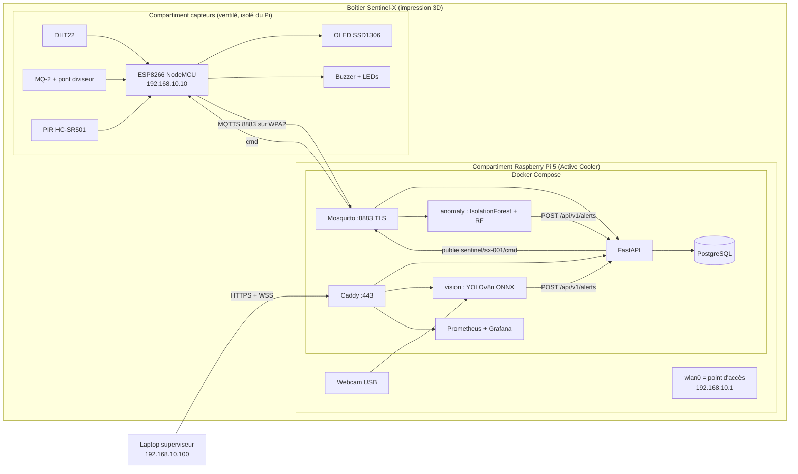

# 🏗️ Architecture globale (Option A : Raspberry Pi 5)

> [!summary] En une phrase
> L'ESP8266 publie les mesures en **MQTTS** vers Mosquitto sur le **Pi 5**, qui sert aussi de **point d'accès Wi-Fi isolé**. L'API FastAPI stocke dans PostgreSQL et pousse en **WebSocket** vers le dashboard. Les services IA (vision et anomalies) lisent la webcam et la télémétrie, puis remontent leurs alertes via **`POST /api/v1/alerts`**. Les boutons du dashboard repartent en MQTT vers le buzzer et les LEDs.

## Schéma


## Version texte (pour le PDF ou un tableau blanc)
```
 ┌──────────────────────── BOÎTIER SENTINEL-X ─────────────────────────┐
 │ [Capteurs]  DHT22 MQ-2 PIR ─► ESP8266 ─► OLED / Buzzer / LEDs       │
 │                                  │ Wi-Fi WPA2 + MQTTS:8883          │
 │                                  ▼                                  │
 │ [Raspberry Pi 5]  wlan0 AP 192.168.10.1     webcam USB              │
 │   Docker: mosquitto ─► api(FastAPI) ─► postgres                     │
 │            │   ▲            ▲   │WS                                 │
 │            ▼   │cmd         │   ▼                                   │
 │          anomaly ──POST──►  │  caddy:443 ◄── laptop (dashboard)     │
 │          vision  ──POST─────┘   prometheus / grafana                │
 └─────────────────────────────────────────────────────────────────────┘
```

## Les 5 flux à démontrer
| # | Flux | Protocole | Chiffré ? |
|---|---|---|---|
| 1 | ESP → broker : télémétrie toutes les 2 s, événements PIR | MQTT sur TLS 1.2 (8883) | ✅ |
| 2 | Broker → API → PostgreSQL → WebSocket → courbes | MQTT interne, SQL, WSS | ✅ côté client (Caddy) |
| 3 | Webcam → vision → alerte « intrusion » et flux MJPEG annoté | `POST /api/v1/alerts`, HTTPS | ✅ |
| 4 | Télémétrie → anomaly → score + alerte prédictive | MQTT interne, `POST /api/v1/alerts` | interne |
| 5 | Bouton du dashboard → API → `cmd` → ESP → buzzer/LED | HTTPS, MQTTS | ✅ |

## Principes
- **Un seul point d'entrée web** (Caddy :443) et **un seul point d'entrée IoT** (Mosquitto :8883). Rien d'autre n'est exposé.
- Les services internes communiquent sur un réseau Docker `internal: true`.
- Tout fonctionne **sans Internet**.
- **Fusion de capteurs**, notre point d'innovation : intrusion *confirmée* quand le PIR et YOLO concordent dans une fenêtre de 3 s ; *suspectée* si un seul des deux se déclenche.

## Liens
[[Réseau et adressage IP]] · [[Flux MQTT et topics]] · [[API REST et WebSocket]] · [[Stack Docker Compose]] · [[Budget RAM et performance]] · [[Matrice de sécurité]]
